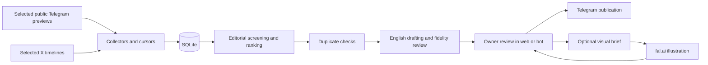

# Architecture

Tweebit is a single-process Python application with a Telegram command interface and a Starlette web editor. SQLite is the source of truth. It is designed for one owner and one active publication channel.

## Components

| Module | Responsibility |
| --- | --- |
| `sources.py` | Allowlisted sources, public Telegram HTML parsing, X pagination and history. |
| `editorial.py` | Editable policy, score schemas, exclusions and daily timezone boundaries. |
| `ai.py` | Structured text-provider calls, selection, semantic comparison, writing, verification and visual briefs. |
| `db.py` | Schema migrations, cursors, queue states, revisions, history, image blobs and attempts. |
| `worker.py` | Collection/processing loop, race checks, owner previews and publication. |
| `formatting.py` | Supported bold notation → plain Telegram text and UTF-16 entities. |
| `usage.py` | Durable per-call token/cost ledger, task-local post attribution and calendar summaries. |
| `images.py` | One synchronous fal request, safe inline JPEG validation, redacted provider failures. |
| `telegram.py` | Bot API calls and multipart photo sending. |
| `bot.py` | Owner-only commands and inline actions. |
| `web.py`, `static/` | Loopback editor, one-time login, source/rule controls, preview and image review. |
| `main.py` | Configuration, process lock and service lifecycle. |

## State and consistency

Posts move from `pending` to `ready`, `filtered`, `duplicate`, `blocked` or `failed`. Publishing commits `sending` before the external request, then records `published`, `send_failed` or `uncertain`. A known rate limit returns the post to `ready` with a retry time. Deleted and skipped records stay available to duplicate detection.

Original publication timestamps are stored independently of ingestion timestamps; missing dates remain null. A configurable age cutoff filters pending candidates, with an explicit owner override. Screening uses a snapshot of at most 50 posts selected across sources. Generation rotates through the best scored candidates per source, so a continuing backlog does not block every draft.

Cursors advance in the transaction that stores the collected posts. Draft history supports the daily budget. Post revisions bind approval to saved state, text and selected image; stale web edits and bot approval callbacks are rejected. Publication and shared mutations use a worker lock. Long text/image-model calls run outside it and recheck state before committing results.

Generated images are candidates until selected. Active attempts block publication; candidates block automatic publication until reviewed. Attempts survive in SQLite for quota accounting. Restart marks unfinished image requests interrupted rather than repeating a potentially billed request.

For a photo plus long text, the confirmed photo message ID is saved before sending the text. Subsequent known retries only send the text. A timeout is still ambiguous, and human resolution remains necessary: Telegram does not provide an application idempotency key for this send flow.

## Trust boundaries

- Only explicitly added public sources are fetched. No personal Telegram session, contact list or dialog enumeration exists.
- Source text is untrusted model input; model instructions separate it from editorial policy.
- The editor binds to loopback and authenticates with an owner-issued one-time code. It checks Host/origin and custom headers for mutations; images require the same session.
- Provider keys remain server-side. Text providers receive source/draft text as needed. fal.ai receives the image brief.
- Local screenshots and tests should use synthetic data. Tests mock external APIs and use temporary databases.

See [Security](../SECURITY.md) and [remaining work](ROADMAP.md).
